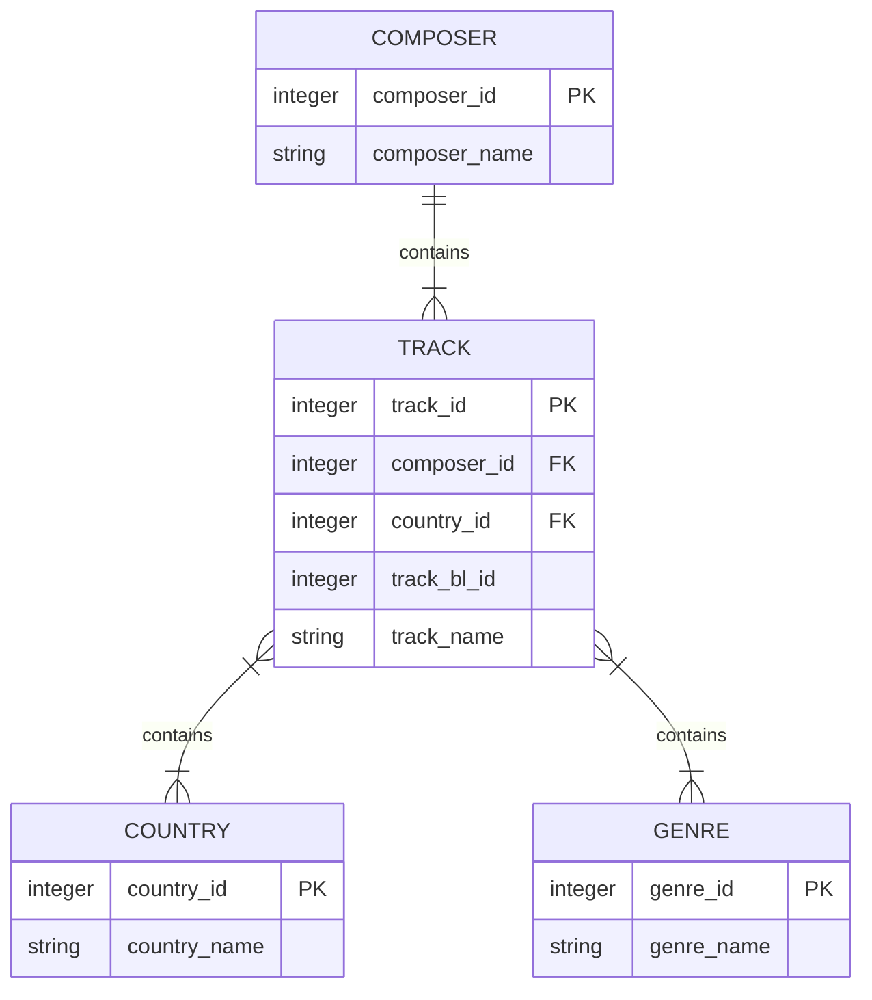

## **Music Catalogue**

Highlights:
- Object-Relational Mapping Using SQLAlchemy
- Generate a SQL database from a CSV file
- Data acquisition using Kaggle API
    - [History of music (British Library)](https://www.kaggle.com/datasets/peacehegemony/history-of-music-bnb)
- SQL queries

Note: This project was inspired by/was based on [this Real Python tutorial](https://realpython.com/python-sqlite-sqlalchemy/#working-with-sqlalchemy-and-python-objects). Credits of the code are granted accordingly throughout the project.

The database that the present workflow creates has the following architecture

