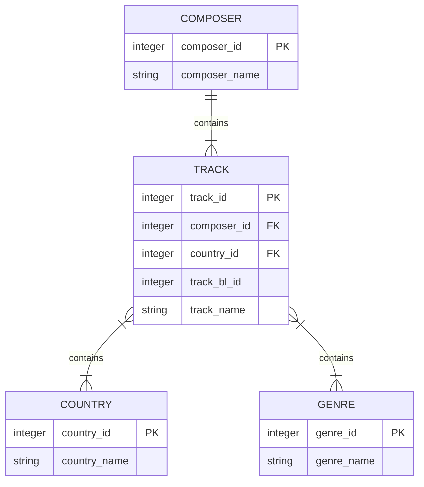

## **Music Catalogue**

### **Highlights**
- Object-Relational Mapping Using SQLAlchemy
- Generate a SQL database from a CSV file
- Data acquisition using Kaggle API
    - [History of music (British Library)](https://www.kaggle.com/datasets/peacehegemony/history-of-music-bnb)


> [!NOTE]
> This project was inspired by/was based on [this Real Python tutorial](https://realpython.com/python-sqlite-sqlalchemy/#working-with-sqlalchemy-and-python-objects). Credits of the code are granted accordingly throughout the project.

The database that the present workflow creates has the following architecture



### **SQL Queries**
Data can be retrieved using simple SQL queries
```
SELECT * FROM COMPOSER;
```

which will return something like
```
1|Hofhaimer, Paul
2|Chapman, Mary
3|Razzi, Serafino
4|Íslenzka stúdentafélag
5|A, A. W.
6|Abel, Karl Friedrich
```

### **Data Acquisition**
> [!IMPORTANT]
> Define Kaggle API Credentials for Data Acquisiton
> Define credentials in `project/data_acquisition/credentials.yml`
> ```
> kaggle:
>      KAGGLE_USERNAME: your_kaggle_username
>      KAGGLE_KEY: your_kaggle_key
> ```


<details>
<summary> How-to Details
</summary>

0. Acquire dataset from Kaggle
```python
python project/data_acquisition/main.py
```

1. Clean Kaggle database using:
```python
python project/generate_data/generate_csv.py
```

2. Create .db database using:
```python
python project/generate_data/generate_db.py
```

3. Add new track and perform simple queries:
```python
python project/queries/q1/main.py
```

4. Perform sql queries in the CL
```shell
sqlite3 project/data/records.db
```
</details>
